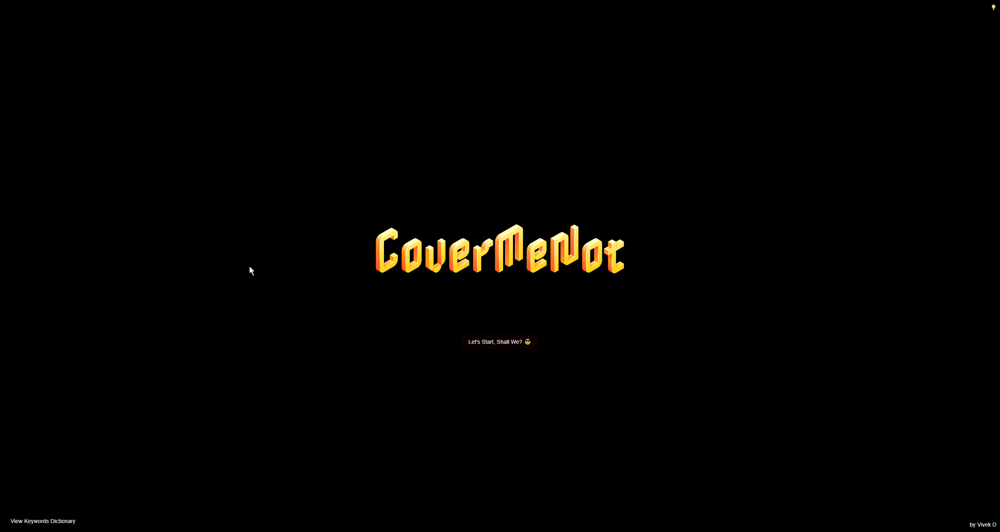
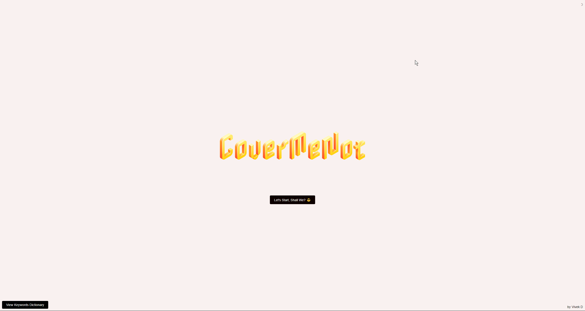
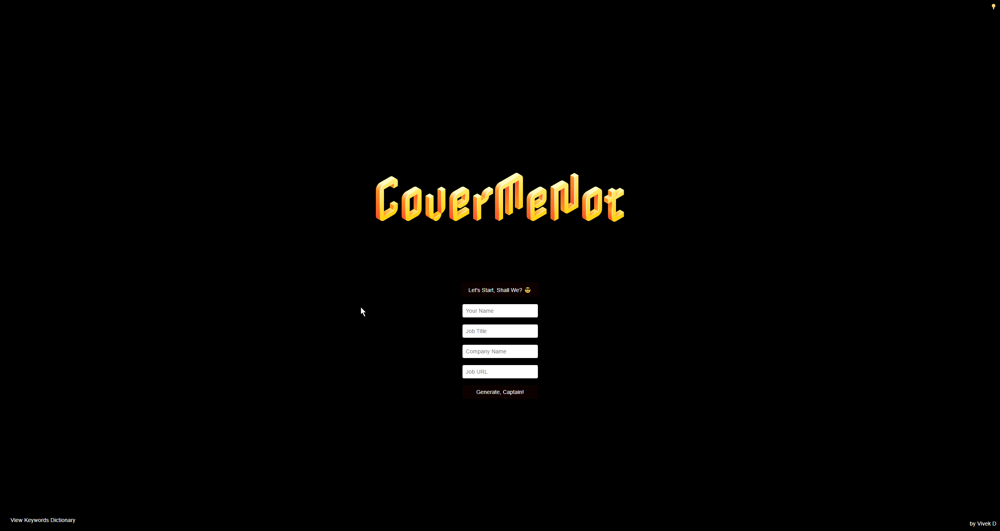

# Work In Progress Project 🚧





## Warning ⚠️
This project is a work in progress. Half the shit isn't working yet, so proceed with caution!

## How to Test 🛠️

To test this project, you can follow these steps:

```bash
# Clone the Repository
git clone https://github.com/vivek-dodia/CoverMeNot_WebApp.git

# Install Requirements
pip install -r requirements.txt

# Run the Engine
python engine_docker.py

# Visit Localhost
Open your browser and go to `localhost:8080`

you can also click on the "view keywords" button on the bottom right to view the keywords that will crosschecked from the job url. 

--------

im working on a function to add the ability to edit keywords directly from webapp.
also adding function to view the generated cover letter directory on the left side of main page.

also the API URLs are 

GET methods to view them programmatically

http://localhost:8080/api/v1/listCoverLetters
http://localhost:8080/api/v1/keywords

POST method to generate the cover letter programmatically via supplying the necessary variables in json format in body.
http://localhost:8080/api/v1/generateCoverLetter
